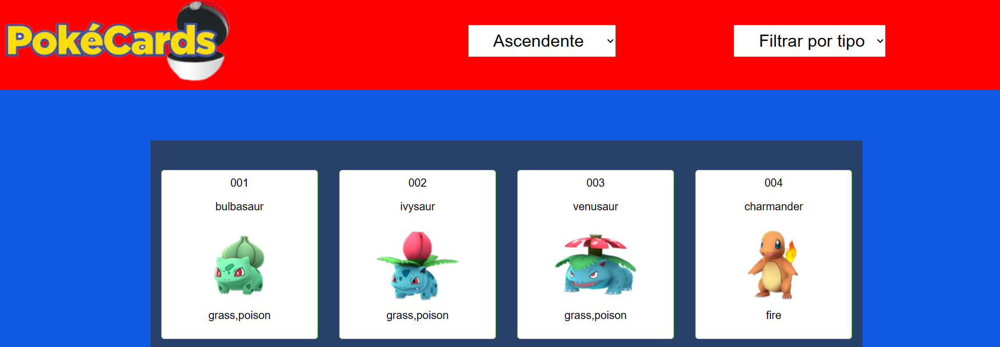
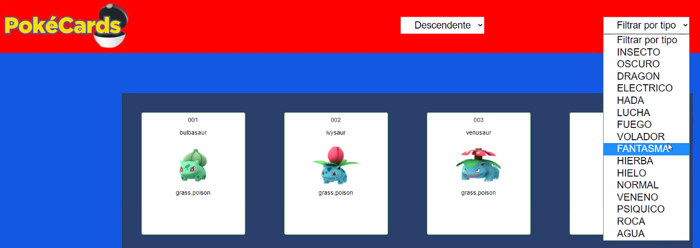
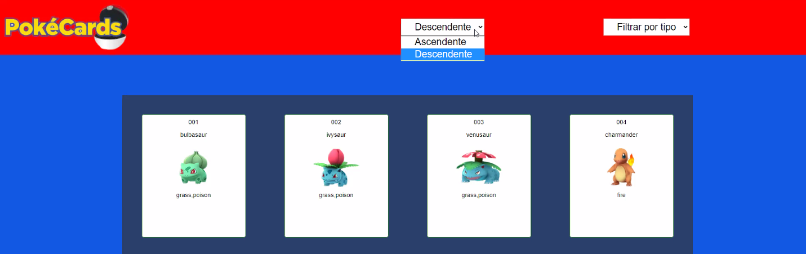
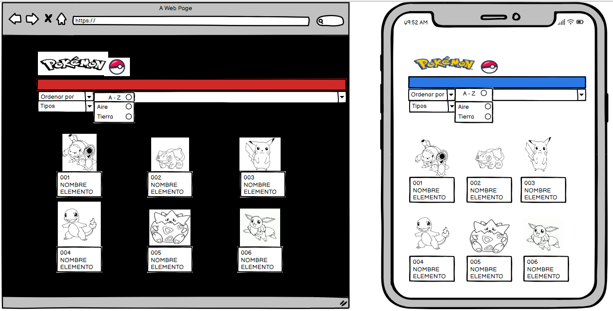
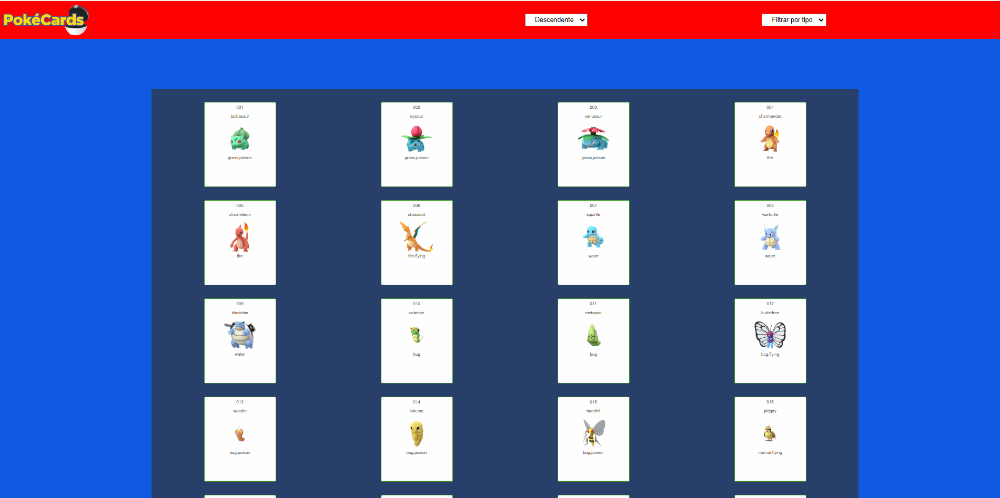

# Data Lovers

## Índice

* [1. Resumen del proyecto](#1-resumen-del-proyecto)
* [2.Historias de usuario](#2-Historias-de-usuario)
* [3. Prototipos](#3-prototipos)
* [4. Pruebas Unitarias](#4pruebas-unitarias)
* [9. Checklist](#9-checklist)

***

## 1. Resumen del proyecto

PokeCards App Web y Móvil te permitirá conocer de manera rápida y sencilla información relevante en relacion a los Pokemones con el objetivo de que puedas convertirte en un maestro Pokemon. Dedicado para cualquier persona que quiera conocer información básica sobre pokémon.

Proceso y decisiones del diseño : Se realizó una encuesta (formulario) previa para recolectar información relevante acerca de los intereses de los usuarios, con la finalidad de crear la página con 251 pokémones y sus caracteristicas principales. Las decisiones del diseño se tomaron para que la App sea lo mas amigable posible con el usuario. Se usaron colores caracteristicos de pokémon.

## 2. Historias de Usuario

1. Se realizó un formulario con el objetivo de conocer la perspectiva del  cliente al momento de ingresar a una página web. Este contiene  una serie de preguntas para entender las necesidades de los usuarios, el cual nos ayudó  para la planificación y construcción del proyecto.

Historia de usuario 1: Yo como usuario de la App quiero poder filtrar los pokemones por tipo para ser qué pokemones son del mismo tipo. Criterio de Aceptación:
Quiero que me liste los pokemones del tipo que seleccioné.
Que cada pokemon de la lista muestre su imagen, número y el/los tipos.

Historia de usuario 2:Yo como usuario de App quiero poder organizar los pokemones de forma Ascendente-Descendente para conocer su nombre.
Seleccionar orden Ascendente-Descendente.
Quiero ver el listado de pokemones segun orden seleccionado.

## 3. Prototipos

#### Prototipo de baja fidelidad

#### Prototipo de alta fidelidad

#### Resultado de la página web 

## 4.Pruebas Unitarias

Nuestras pruebas unitarias corren al 100%

## 9. Checklist

* [✔] Usa VanillaJS.
* [✔] Pasa linter (`npm run pretest`)
* [✔] Pasa tests (`npm test`)
* [✔] Pruebas unitarias cubren un mínimo del 70% de statements, functions y
  lines y branches.
* [✔] Incluye _Definición del producto_ clara e informativa en `README.md`.
* [✔] Incluye historias de usuario en `README.md`.
* [✔] Incluye _sketch_ de la solución (prototipo de baja fidelidad) en
  `README.md`.
* [✔] Incluye _Diseño de la Interfaz de Usuario_ (prototipo de alta fidelidad)
  en `README.md`.
* [ ] Incluye link a Zeplin en `README.md`.
* [✔] Incluye el listado de problemas que detectaste a través de tests de
  usabilidad en el `README.md`.
* [ ] UI: Muestra lista y/o tabla con datos y/o indicadores.
* [✔] UI: Permite ordenar data por uno o más campos (asc y desc).
* [✔] UI: Permite filtrar data en base a una condición.
* [✔] UI: Es _responsive_.
